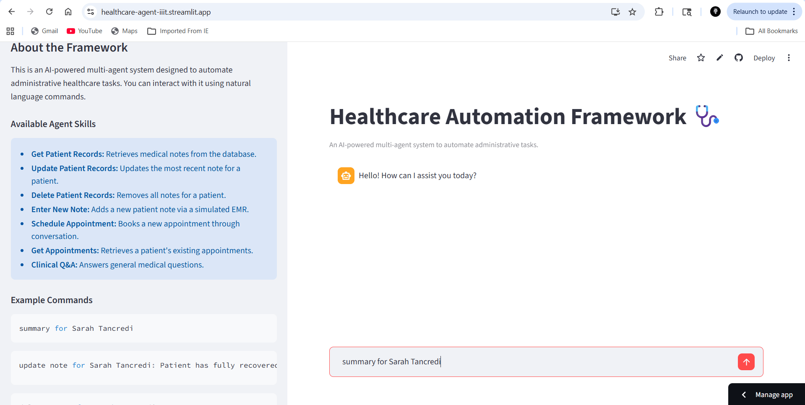

# AI-Powered Healthcare Automation Framework

[](https://opensource.org/licenses/MIT)
[](https://www.python.org/downloads/)

This project is a functional prototype of an LLM-based multi-agent system designed to automate administrative workflows in healthcare, based on the principles outlined in the research paper ["LLM-Based Framework for Administrative Task Automation in Healthcare"](https://ieeexplore.ieee.org/document/10527275).

The framework uses a central Orchestrator to interpret natural language commands and delegate tasks to specialized agents, including retrieving patient data, automating EMR entries, and answering clinical questions. The system is built with a pluggable backend, allowing it to run on a 100% local, privacy-first model (Ollama) or a high-performance cloud API (OpenAI).

### Live Application Demo


*(A demonstration of the Streamlit GUI, showing the conversational appointment booking and a query to the Clinical QA Agent.)*

---

## Key Features

- **Multi-Agent Architecture:** An AI **Orchestrator** intelligently routes tasks to the appropriate specialized agent.
- **Conversational AI:** The **SchedulingAgent** can engage in multi-turn dialogues to gather all necessary information (patient name, date, hospital) for booking an appointment.
- **RAG for Q&A:** A **ClinicalQAAgent** uses Retrieval-Augmented Generation (RAG) with a FAISS vector store over the MedQA dataset to provide accurate, context-aware answers to complex medical questions.
- **Database Integration:** All patient notes and appointments are stored persistently in a robust **SQLite** database, supporting full CRUD (Create, Read, Update, Delete) operations.
- **Web Automation:** A **WebAgent** uses Selenium to autonomously interact with a mock Electronic Medical Record (EMR) system for automated data entry.
- **Pluggable LLM Backend:** Easily switch between a secure, local **Ollama/Llama 3** model and a high-performance **OpenAI GPT-4o mini** API.
- **User-Friendly GUI:** A clean and interactive web interface built with **Streamlit**.

---

## Tech Stack

- **Backend:** Python
- **AI / LLM Orchestration:** LangChain
- **LLM Backends:** Ollama (Llama 3), OpenAI API (GPT-4o mini)
- **GUI:** Streamlit
- **Database:** SQLite
- **Web Automation:** Selenium
- **Embeddings & Vector Store:** Hugging Face Sentence-Transformers, FAISS

---

## Local Setup and Installation

### Prerequisites

- Python 3.10+
- [Git](https://git-scm.com/downloads)
- (Optional but Recommended) An [Ollama](https://ollama.com/) installation for local model usage.

### Installation Steps

1.  **Clone the repository:**
    ```bash
    git clone https://github.com/YourUsername/healthcare-agent-framework.git
    cd healthcare-agent-framework
    ```

2.  **Create and activate a virtual environment:**
    ```bash
    python -m venv venv
    # On Windows
    .\venv\Scripts\activate
    # On macOS/Linux
    source venv/bin/activate
    ```

3.  **Install the required packages:**
    ```bash
    pip install -r requirements.txt
    ```

4.  **Set up your API Key (if using OpenAI):**
    - Create a file named `.env` in the root directory.
    - Add your OpenAI API key to it:
      ```
      OPENAI_API_KEY="sk-xxxxxxxxxxxxxxxxxxxxxxxxxxxxxxxxxxxxxxxx"
      ```

5.  **(First Time Only) Download the MedQA Dataset:**
    - Run the download script. This will download the dataset and create the local vector store cache. This process is slow and may take several minutes.
    ```bash
    python download_medqa.py
    ```

### Running the Application

1.  **Ensure Ollama is running (if using the local model).**

2.  **Run the Streamlit app:**
    ```bash
    streamlit run app.py
    ```
    Your browser will open with the application running locally.

---

## GitHub Repository Description

Now, for the repository itself on GitHub, you need a short, one-line description.

**Description:**
> An LLM-based multi-agent framework built with LangChain and Streamlit to automate administrative healthcare tasks like data retrieval, EMR entry, and appointment booking.

**Topics/Keywords:**
When you edit your repository details on GitHub, add these topics. They are crucial for making your project discoverable.
`python`, `langchain`, `streamlit`, `llm`, `multi-agent-systems`, `rag`, `healthcare-ai`, `selenium`, `ollama`, `openai-api`, `sqlite`